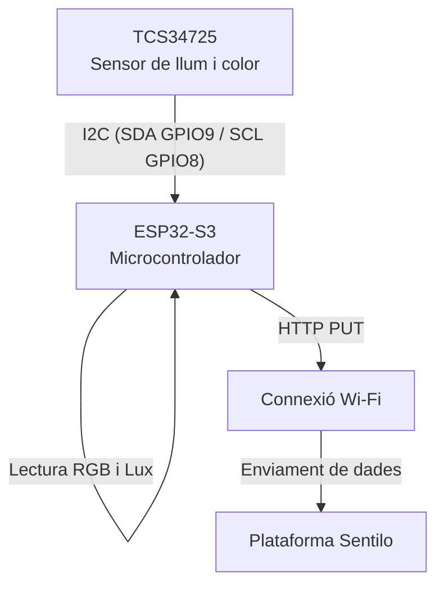
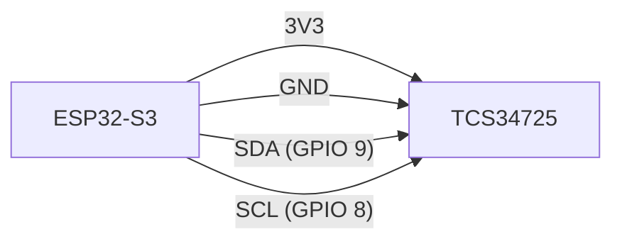

# Monitoratge de la contaminació lumínica i l'eficiència de l'enllumenat públic

## Projecte d’enginyeria

**Autoria:** Núria Rodríguez · Montserrat Cuevas · Imelda Run Montes

---

## Índex

1. Introducció
2. Objectius del projecte
   2.1. Objectius generals
   2.2. Objectius específics
3. Marc teòric: contaminació lumínica i il·luminació eficient
   3.1. Definició de contaminació lumínica
   3.2. Mètriques de la llum i el sensor TCS34725
   3.3. Eficiència de l'enllumenat públic
4. Materials i components
   4.1. Microcontrolador principal
   4.2. Sensor de llum i color
   4.3. Configuració del servidor (Sentilo)
5. Programació del sistema
   5.1. Declaracions globals i llibreries
   5.2. Funció clau d’enviament de dades
   5.3. Funció `setup()`
   5.4. Funció `loop()`
6. Diagrama de funcionament
7. Diagrama de connexions
   7.1. Taula de connexions
   7.2. Representació gràfica
8. Integració amb la plataforma Sentilo
   8.1. Model de dades Sentilo
   8.2. Mètriques enviades
   8.3. Validació de la connectivitat
9. Resultats
10. Càlculs i anàlisi de resultats
    10.1. Anàlisi de dades
    10.2. Càlcul de la temperatura de color (CCT)
    10.3. Càlcul de l’índex de llum blava
    10.4. Anàlisi global dels resultats
11. Conclusions
12. Bibliografia i annexos

---

## 1. Introducció

La contaminació lumínica és un problema ambiental creixent que afecta tant els ecosistemes naturals com la qualitat de vida de les persones, a més de suposar un important malbaratament energètic. Una gestió inadequada de l’enllumenat públic pot provocar una emissió excessiva de llum durant la nit, amb conseqüències negatives a nivell ecològic, astronòmic i social.

En aquest context, el monitoratge i la gestió intel·ligent de l’enllumenat públic esdevenen eines clau per avançar cap a models urbans més sostenibles. Aquest projecte se centra en el disseny i la implementació d’un sistema de baix cost basat en microcontroladors per a la captació de dades de lluminositat —tant del nivell de lux com dels components RGB— en punts estratègics de l’entorn urbà.

La solució proposada utilitza un microcontrolador **ESP32-S3** i un sensor de llum i color **TCS34725**, i envia les dades recollides a la plataforma IoT **Sentilo**, permetent-ne l’anàlisi posterior per avaluar el grau de contaminació lumínica i l’eficiència energètica segons la normativa vigent.

---

## 2. Objectius del projecte

### 2.1. Objectius generals

* Desenvolupar un sistema de monitoratge IoT robust, fiable i de baix cost per a entorns urbans.
* Proporcionar dades en temps real a la plataforma Sentilo per facilitar l’anàlisi de la contaminació lumínica i de l’eficiència energètica.

### 2.2. Objectius específics

* Integrar correctament el sensor TCS34725 mitjançant el protocol I2C.
* Establir una connexió Wi‑Fi estable entre el dispositiu i la xarxa local.
* Implementar l’enviament de dades a Sentilo mitjançant peticions HTTP PUT autenticades.
* Recollir i enviar de manera periòdica les mètriques de llum: nivell de lux i components RGB (R, G i B).
* Dissenyar una solució de maquinari compacta, reproduïble i apta per a la seva instal·lació en fanals o punts de mesura urbans.

---

## 3. Marc teòric: contaminació lumínica i il·luminació eficient

### 3.1. Definició de contaminació lumínica

La contaminació lumínica es defineix com l’emissió de llum artificial nocturna en intensitats, direccions o horaris innecessaris. Aquest fenomen té diversos impactes negatius:

* **Impacte astronòmic:** dificultat per a l’observació del cel nocturn.
* **Impacte ecològic:** alteració dels ritmes circadians de la fauna nocturna.
* **Impacte sobre la salut humana:** interferència en els patrons de son i disminució de la producció de melatonina.

### 3.2. Mètriques de la llum i el sensor TCS34725

El sensor TCS34725 mesura quatre components principals:

* **Clear (C):** intensitat total de la llum, utilitzada per al càlcul del nivell de lux.
* **Red (R), Green (G) i Blue (B):** intensitat de la llum en les respectives longituds d’ona.
* **Lux (lx):** unitat del Sistema Internacional que mesura la il·luminació percebuda per l’ull humà.

### 3.3. Eficiència de l'enllumenat públic

Un sistema d’enllumenat públic eficient ha de complir els criteris següents:

* Proporcionar els nivells de lux adequats per garantir la seguretat sense sobreil·luminació.
* Utilitzar lluminàries amb temperatura de color baixa (preferiblement per sota dels 3000 K).
* Minimitzar l’emissió de llum blava, que és la més perjudicial per al medi ambient.

Aquest projecte pren com a referència el **Decret 190/2015** de la Generalitat de Catalunya.

---

## 4. Materials i components

### 4.1. Microcontrolador principal

* **Model:** ESP32-S3
* **Funció:** execució del programa principal, comunicació I2C amb el sensor, connexió Wi‑Fi i enviament de dades a Sentilo mitjançant HTTP.

### 4.2. Sensor de llum i color

* **Model:** Adafruit TCS34725
* **Funció:** mesura de la llum ambiental i dels components espectrals RGB.

**Configuració utilitzada:**

* Temps d’integració: 50 ms
* Guany: 4×

### 4.3. Configuració del servidor (Sentilo)

* **Base URL:** `http://147.83.83.21:8081/data/grup_1-102@Eficiencia_llum`
* **Token d’autenticació (IDENTITY_KEY):** necessari per garantir l’accés segur a la plataforma.

---

## 5. Programació del sistema

### 5.1. Declaracions globals i llibreries

S’utilitzen llibreries per gestionar la connexió Wi‑Fi, les peticions HTTP, la comunicació I2C i el sensor TCS34725.

```cpp
#include <WiFi.h>
#include <HTTPClient.h>
#include <Wire.h>
#include "Adafruit_TCS34725.h"
```

### 5.2. Funció clau d’enviament de dades

La funció `enviarASentilo()` s’encarrega d’enviar les dades a la plataforma Sentilo mitjançant peticions HTTP PUT autenticades.

### 5.3. Funció `setup()`

Inicialitza la comunicació sèrie, el sensor, la interfície I2C i estableix la connexió Wi‑Fi.

### 5.4. Funció `loop()`

* Lectura periòdica del sensor.
* Enviament seqüencial de les dades de lux i RGB.
* Interval de 5 segons entre mostres per evitar la saturació del sistema.

---

## 6. Diagrama de funcionament

El diagrama de flux representa el funcionament general del sistema, des de la lectura del sensor fins a l’enviament de dades a la plataforma Sentilo.



---

## 7. Diagrama de connexions

### 7.1. Taula de connexions

| TCS34725 | ESP32-S3 | Descripció   |
| -------- | -------- | ------------ |
| VCC      | 3V3      | Alimentació  |
| GND      | GND      | Terra        |
| SDA      | GPIO 9   | Dades I2C    |
| SCL      | GPIO 8   | Rellotge I2C |

### 7.2. Representació gràfica

Esquema de la interconnexió física entre el microcontrolador i el sensor, amb especial èmfasi en les connexions elèctriques i de comunicació.



---

## 8. Integració amb la plataforma Sentilo

### 8.1. Model de dades Sentilo

Les dades s’envien mitjançant peticions HTTP PUT seguint l’estructura:

```
Servidor/data/Proveïdor@Asset/Recurs/Valor
```

### 8.2. Mètriques enviades

* `sensor_de_llum` (lux)
* `RGB_R`
* `RGB_G`
* `RGB_B`

### 8.3. Validació de la connectivitat

* La connexió Wi‑Fi es valida durant el `setup()`.
* Un codi de resposta HTTP correcte indica l’enviament satisfactori de les dades.

---

## 9. Resultats

Les dades es van registrar a la plataforma Sentilo el dia 17/11/2025 entre les 20:00 h i les 20:30 h a la ciutat de Terrassa.

---

## 10. Càlculs i anàlisi de resultats

### 10.1. Anàlisi de dades

Les dades recollides permeten detectar possibles situacions de sobreil·luminació nocturna i analitzar la presència excessiva de component blau.

### 10.2. Càlcul de la temperatura de color (CCT)

Tot i que el CCT no es calcula directament al microcontrolador, es pot obtenir posteriorment a partir de les dades RGB.

### 10.3. Càlcul de l’índex de llum blava

```
IB = B / (R + G + B)
```

Valors superiors a 0,4 indiquen una possible temperatura de color superior a 4000 K.

### 10.4. Anàlisi global dels resultats

L’anàlisi mostra que algunes zones no compleixen els límits establerts pel Decret 190/2015, especialment en àrees residencials.

---

## 11. Conclusions

El projecte demostra la viabilitat d’un sistema de baix cost per al monitoratge de la contaminació lumínica en temps real. La integració amb Sentilo permet una gestió eficient de les dades i ofereix una eina escalable per ajudar les administracions a millorar la sostenibilitat i l’eficiència de l’enllumenat públic.

---

## 12. Bibliografia i annexos

### Bibliografia

* Sentilo Arduino Tutorial
* Decret 190/2015, Generalitat de Catalunya
